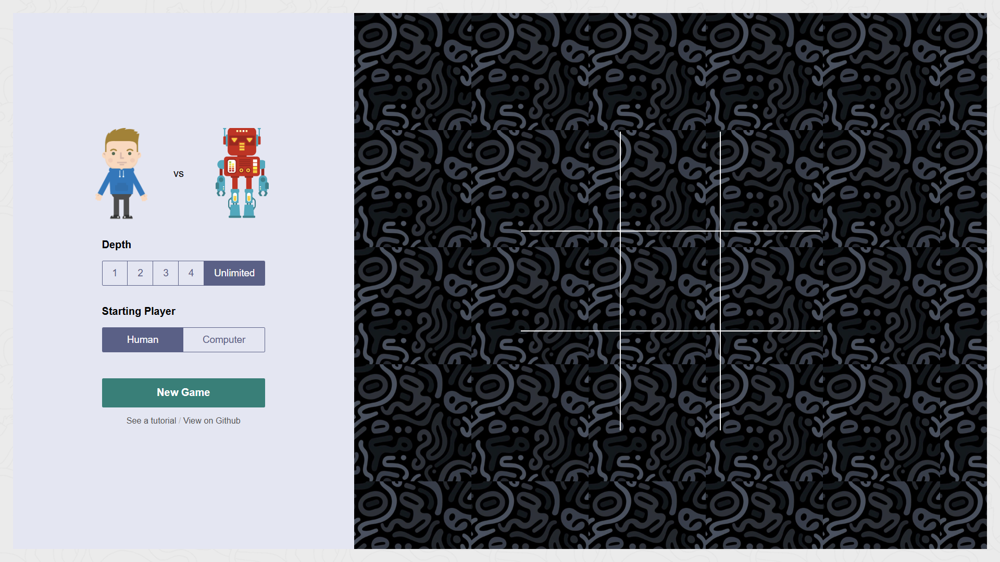

# TicTacToe
JavaScript Based Project - 1Week1Project Challenge


# Tic Tac Toe Game 🎮  

A simple and interactive Tic Tac Toe game built with HTML, CSS, and JavaScript. This project demonstrates the implementation of a classic game where two players compete to form a line of Xs or Os on a 3x3 grid.  

## 🚀 Live Demo  
Demo : [TicTacToe!](https://codebyashuu.github.io/TicTacToe/)  

---

## 📋 Features  
- **Single Player Mode**: Play against a computer with built-in logic.  
- **Computer Logic**: The computer evaluates moves with a specific depth of strategy.  
- **Choose Starting Player**: Decide who makes the first move—you or the computer.  
- **Interactive UI**: Clean and responsive design for seamless gameplay.  
- **Reset Functionality**: Restart the game anytime with a single click.  

---

## 🛠️ Technologies Used  
- **HTML**: To structure the game interface.  
- **CSS**: For basic styling.  
- **SCSS**: To write maintainable and reusable styles efficiently.  
- **JavaScript**: To implement game logic, computer AI, and interactivity.  

---

## 🖼️ Screenshots  


---

## 📂 Installation  
1. Clone this repository:  
   ```bash
   git clone https://github.com/CodeByAshuu/TicTacToe.git
